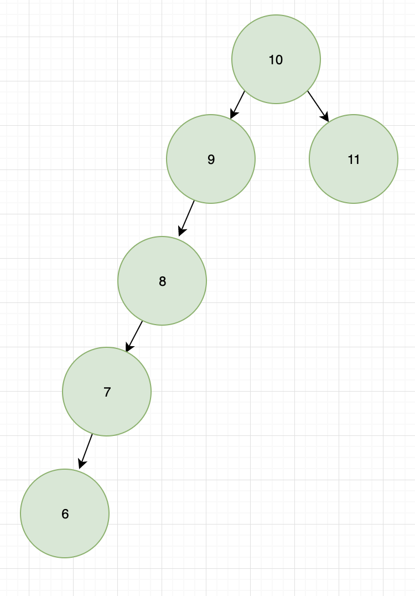

# 漫画算法-树

## 树和二叉树

### 树

许多逻辑关系并不是简单的线性关系，常常存在一对多，多对多的情况。树和图就是典型的非线性数据结构。

比如“家谱”是一个树，企业的职级关系是一个树。一本书的目录也是一个树。

定义：树是 n (n >= 0)个节点的有限集。当 n = 0 时，称为空树。在任意一个非空树中，有如下特点：

- 有且只有一个特定的称为根的节点。
- 当 n > 1 时，其余节点可分为 m（m > 0）个互不相交的有限集。每一个集合本身又是一个树，并称为根的子树。

几个概念：

__父节点__：某个节点的上一个节点。

__孩子节点__：某个节点衍生出来的节点。

__兄弟节点__：同一个父节点衍生出来的同级节点。

__叶子节点__：处于树的末端，没有子节点。

### 二叉树（binary tree）

这种树的每个节点最多有 2 个孩子节点。


其中，左孩子节点和右孩子节点的顺序是固定的。

二叉树的两种特殊格式：

- 满二叉树：所有节点都是满的，且所有叶子节点都在同一层级上。要求所有节点都是满的。
- 完全二叉树：有 n 个节点，与相同深度的满二叉树的 1 到 n 个节点位置相同。只需保证最后一个节点之前的节点齐全。

二叉树属于逻辑结构，可以通过多种物理结构来表达：

- 链式存储结构
- 数组

用链表表示：

包含了存储数据的 data 变量，指向左孩子的 left 指针，指向右孩子的 right 指针。


用数组表示：


按照层级顺序把二叉树的节点放到数组相应的下标位置中。如果某个左孩子或右孩子缺失，数组相应的位置会空出来。

这样可以方便地定位孩子节点和父节点的位置。

```js
leftChild = parent * 2 + 1;
rightChild = parent * 2 + 2;
parent = (leftChild - 1) / 2;
```

### 二叉树的应用

主要作用：查找操作和维持相对顺序。

1、查找

特殊的二叉树：二叉查找树（binary search tree）。

二叉查找树在二叉树的基础上加了几个条件：

- 如果左子树不为空，则左子树上所有节点的值都小于根节点的值。
- 如果右子树不为空，则右子树上所有节点的值都大于根节点的值。
- 左右子树都是二叉查找树

二叉查找树：


查找步骤：

1. 比如查找 4，发现 4 < 6，查左子树，找到 3。
2. 发现 4 > 3，查右子树，找到 4，查找完成。

对于一个节点分布相对均匀的二叉树来说，每次都是除以 2，所以算法复杂度是 O(logn)。

2、维持相对顺序

二叉查找树要求左子树的节点小于根节点，右子树的节点大于根节点，这样就保证了二叉树的有序性。

二叉树还有另一个名字：二叉排序树（binary sort tree）。

问题：在下面的二叉查找树中插入 9、8、7、6 等。


插入后：



时间复杂度退化成了 O(n)。

解决这个问题，涉及到二叉树的自平衡：红黑树、AVL树、树堆等。

